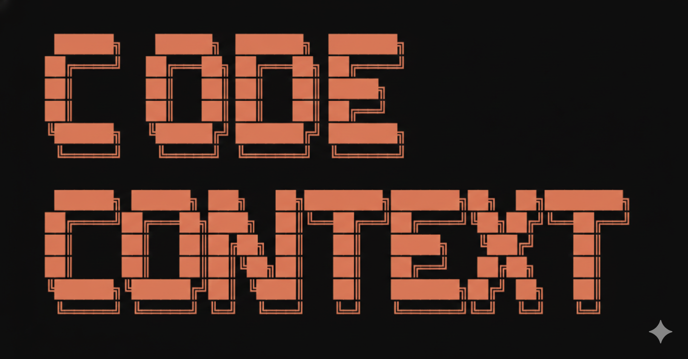

# Code Context Documentation

Welcome to the Code Context documentation! Code Context is a powerful tool that adds semantic code search capabilities to AI coding assistants through MCP.

## 🚀 Quick Navigation

### Getting Started
- [🛠️ Prerequisites](getting-started/prerequisites.md) - What you need before starting
- [🔍 Environment Variables](getting-started/environment-variables.md) - How to configure environment variables for MCP
- [⚡ Quick Start Guide](getting-started/quick-start.md) - Get up and running in 1 minutes

### Components
- [MCP Server](../packages/mcp/README.md) - The MCP server of Code Context
- [Core Package](../packages/core/README.md) - The core package of Code Context

### Dive Deep
- [File Inclusion & Exclusion Rules](dive-deep/file-inclusion-rules.md) - Detailed explanation of file inclusion and exclusion rules
- [Asynchronous Indexing Workflow](dive-deep/asynchronous-indexing-workflow.md) - Detailed explanation of asynchronous indexing workflow

### Troubleshooting
- [❓ FAQ](troubleshooting/faq.md) - Frequently asked questions
- [🐛 Troubleshooting Guide](troubleshooting/troubleshooting-guide.md) - Troubleshooting guide

## 🔗 External Resources

- [GitHub Repository](https://github.com/tan-yong-sheng/code-context)
- [npm - Core Package](https://www.npmjs.com/package/@tan-yong-sheng/code-context-core)
- [npm - MCP Server](https://www.npmjs.com/package/@tan-yong-sheng/code-context-mcp)

## 💬 Support

- **Issues**: [GitHub Issues](https://github.com/tan-yong-sheng/code-context/issues)
- **Discord**: [Join our Discord](https://discord.gg/mKc3R95yE5)
